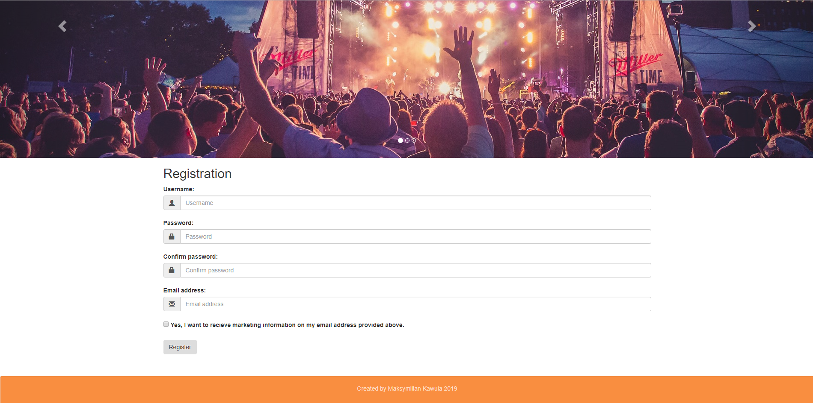
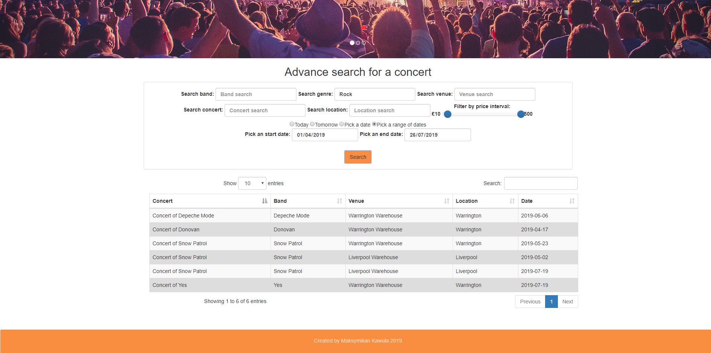
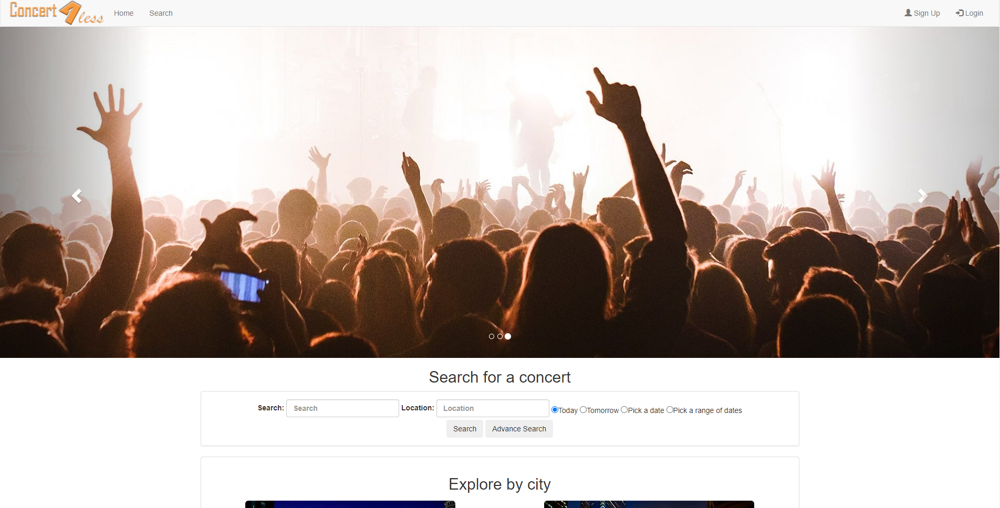
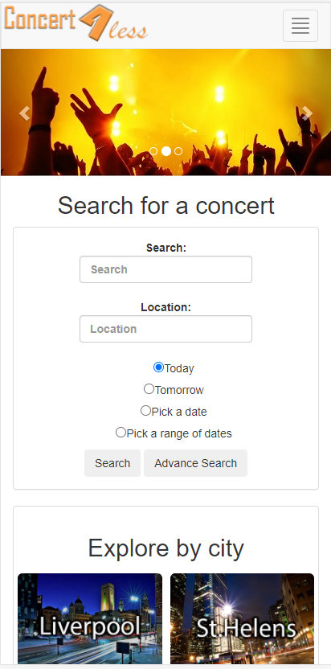
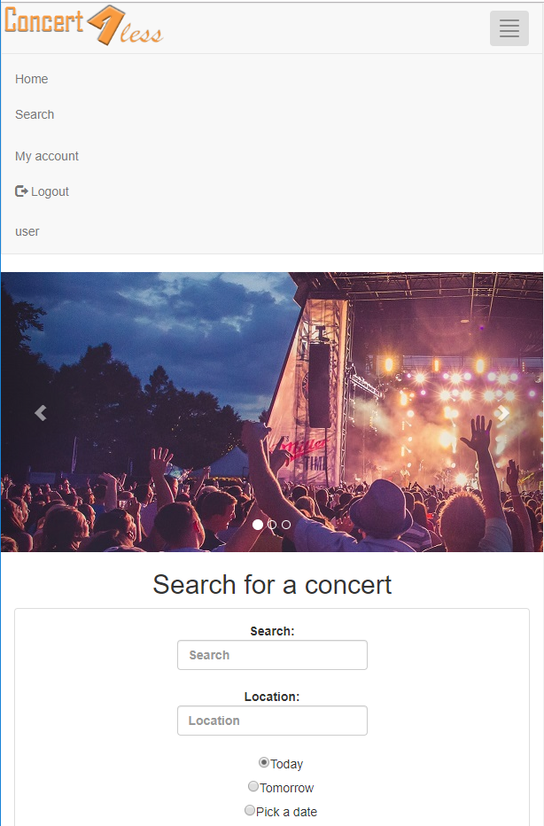
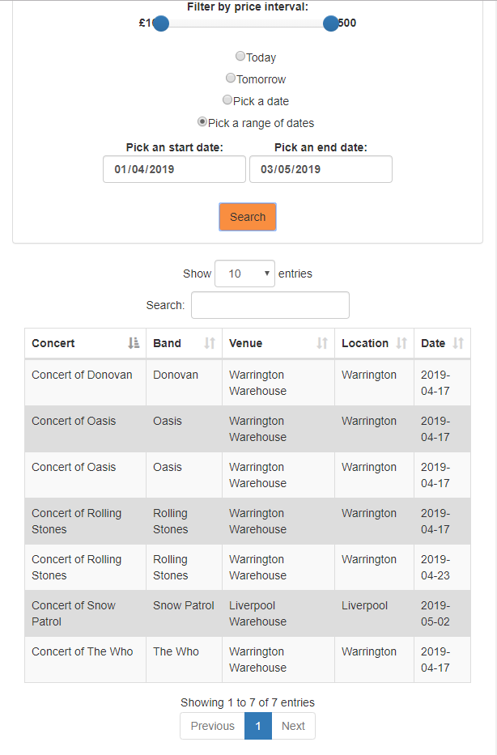

# Concert4Less Web application

University project. Achieved grade 96%.

## Details of the task
In this assignment, you are required to implement a dynamic web application for the Concert management system, which will allow users to search for concerts, according to various search criteria. The search functionality should be as flexible as possible. The web app should allow users to register and log in and provide them with an account page with their relevant details which can be edited.

## Requirement specifications

The web app should use PHP and run on an Apache Web Server (via XAMPP), using the Eclipse PHP IDE as the development environment. The application will be developed as an Eclipse-based PHP project. You will also be required to implement a MySQL database (via PHPMyAdmin on XAMPP) containing representative sample data for the purposes of testing your site and to connect to this MySQL database from your server-side code.

The PHP application will be using version 7 of this language. The application is required to present the application front-end user interface to the user using a combination of HTML5, CSS3 and JavaScript ES6/ES7. The user-interface should be dynamically generated using PHP web development techniques.

The web application will be accessed via Windows and a recent version of the Google Chrome web browser.
The client-side user interface should utilise any appropriate front-end web frameworks to render the HTML5 markup that comprises the content and structure of the site. The site should be styled using CSS3 and work with both Mobile and Desktop clients. You can also use JavaScript frameworks such as JQuery, Bootstrap.js, FontAwesome.js, Google Maps API etc. for the client-side behaviour of your application, which can provide extra marks. You may also incorporate any other JavaScript frameworks that you deem useful to the development of your application. You must clearly identify which frameworks have been used (as a comment in your code or in the Assignment 1 report, for example), and ensure that all coding outside of these frameworks is your own.

You will be marked on non-functional aspects of your website as well as on its functionality. Marks are available for accessibility, responsiveness and validation of user input. Using AJAX/JSON to enable partial page updates can also allow higher marks to be achieved. Good coding style also carries some marks (all coding should be your own). You should strive to allow maximum flexibility for the user to search for concerts.

## Screenshots of the web application

</img>
</img>
</img>
</img>
</img>
</img>
